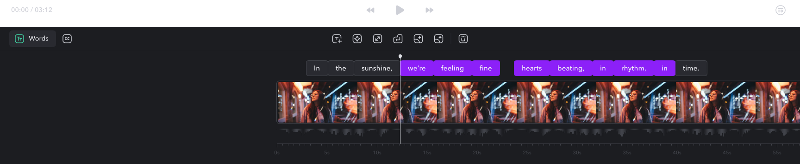

After applying settings and styles to all of your captions, you may want to edit individual words, add additional effects, or override settings for individual words.

    <Tabs>
        <Tab title="iOS">
            ### Single Words

            **Edit Spelling**

            Tap **Edit** to edit the spelling of the individual word

            **Breaks**

            Tap **Breaks** to adjust how this particular word appears in relation to the words before and after. Choose from Auto, Line Break, Page Break, or No Break

            **Supersize**

            Tap **Supersize** to enable or disable the Supersize effect. Supersize will make your word larger than the default size of all words.

            **Emphasize**

            Tap **Emphasize** to have the word appear with the emphasis color activated.

            **Emojis**

            Tap **Emojis** to manually apply a standard or animated emoji to appear with the selected word.

            **Media**

            Tap **Media** to:

            - Import a photo or video
            - Search for a GIF
            - Search for a stock photo

            After adding, you can adjust the position, transition and duration.

            **Underline**

            Tap **Underline** to apply an underline on the selected word.

            **Effects**

            Tap **Effects** to apply a background effect on the selected word.

            **Sounds**

            Tap **Sounds** to apply a sound effect on the selected word.

            **Color**

            Tap **Color** to apply a color to override the selected word.

            **Font**

            Tap **Font** to apply a font to override the selected word.

            **Visibility**

            Tap **Visibility** to show or hide the selected word.

            **Timing**

            Tap **Timing** to adjust the timing of the selected word.

            **Delete**

            Tap **Delete** to delete the entire word

            ### Multi-select

            It is only possible to select multiple words using the desktop app.
        </Tab>

        <Tab title="Desktop">
            ### Single Words

            **Edit Spelling**

            Click on any word and start typing to edit the spelling of the individual word

            **Supersize**

            Click on any word and select **Supersize** to enable or disable the Supersize effect. Supersize will make your word larger than the default size of all words.

            **Emphasize**

            Click on any word and select **Emphasize** to have the word appear with the emphasis color activated.

            **Breaks**

            Click on any word and select **Breaks** to adjust how this particular word appears in relation to the words before and after. Choose from Auto, Line Break, Page Break, or No Break

            **Hide Words**

            Click **Phrases** and select **Hide**

            **Delete Words**

            Click on any word and select **Delete**.

            ### **Multi-select**

            To apply effects to multiple words at a time, first click a single word. Then:

            - To apply to multiple words *not in order*, hold COMMAND, then click the words in which you’d like to apply the effect
            - To apply to multiple words *in a row*, hold SELECT, then click on the last word in which you’d like to apply the effect
            <Frame>
                
            </Frame>
            <Frame>
                
            </Frame>
        </Tab>
        <Tab title="Android">
            Coming soon to Android. Please sign up for the [waitlist](/docs/app/android).
        </Tab>
    </Tabs>

    <Tabs>

        <Tab title="Desktop">
            ### Single Words

            **Edit Spelling**

            Click on any word and start typing to edit the spelling of the individual word

            **Supersize**

            Click on any word and select **Supersize** to enable or disable the Supersize effect. Supersize will make your word larger than the default size of all words.

            **Emphasize**

            Click on any word and select **Emphasize** to have the word appear with the emphasis color activated.

            **Breaks**

            Click on any word and select **Breaks** to adjust how this particular word appears in relation to the words before and after. Choose from Auto, Line Break, Page Break, or No Break

            **Hide Words**

            Click **Phrases** and select **Hide**

            **Delete Words**

            Click on any word and select **Delete**.

            ### **Multi-select**

            To apply effects to multiple words at a time, first click a single word. Then:

            - To apply to multiple words *not in order*, hold COMMAND, then click the words in which you’d like to apply the effect
            - To apply to multiple words *in a row*, hold SELECT, then click on the last word in which you’d like to apply the effect
            <Frame>
                
            </Frame>
            <Frame>
                
            </Frame>
        </Tab>

        <Tab title="iOS">
            ### Single Words

            **Edit Spelling**

            Tap **Edit** to edit the spelling of the individual word

            **Breaks**

            Tap **Breaks** to adjust how this particular word appears in relation to the words before and after. Choose from Auto, Line Break, Page Break, or No Break

            **Supersize**

            Tap **Supersize** to enable or disable the Supersize effect. Supersize will make your word larger than the default size of all words.

            **Emphasize**

            Tap **Emphasize** to have the word appear with the emphasis color activated.

            **Emojis**

            Tap **Emojis** to manually apply a standard or animated emoji to appear with the selected word.

            **Media**

            Tap **Media** to:

            - Import a photo or video
            - Search for a GIF
            - Search for a stock photo

            After adding, you can adjust the position, transition and duration.

            **Underline**

            Tap **Underline** to apply an underline on the selected word.

            **Effects**

            Tap **Effects** to apply a background effect on the selected word.

            **Sounds**

            Tap **Sounds** to apply a sound effect on the selected word.

            **Color**

            Tap **Color** to apply a color to override the selected word.

            **Font**

            Tap **Font** to apply a font to override the selected word.

            **Visibility**

            Tap **Visibility** to show or hide the selected word.

            **Timing**

            Tap **Timing** to adjust the timing of the selected word.

            **Delete**

            Tap **Delete** to delete the entire word

            ### Multi-select

            It is only possible to select multiple words using the desktop app.
        </Tab>

        <Tab title="Android">
            Coming soon to Android. Please sign up for the [waitlist](/docs/app/android).
        </Tab>
    </Tabs>

