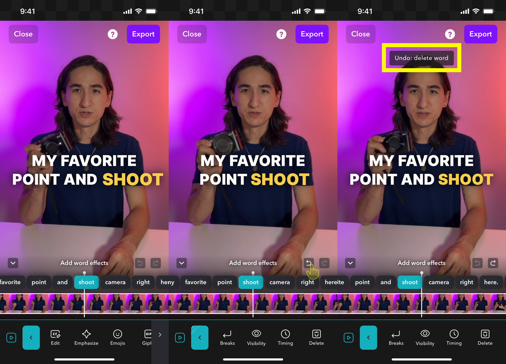

<Note>
    Undo and Redo is only possible while you are actively editing. Once you close the app or save your project (and return to the project screen), you won’t be able to Undo any longer.
</Note>

    <Tabs>
        <Tab title="iOS">
            To **undo** an action, simply tap the icon above the timeline. A notification will appear letting you know which action you've just undone. Need to redo an action? Simply tap the **redo** button.
            You can **undo** or **redo** as often as you like within a single session, but once you return to the Project screen (either by saving or exporting), you won't be able to undo or redo.
        
            <Frame>
                
            </Frame>
        </Tab>

        <Tab title="Desktop">
            Coming soon to Desktop.
        </Tab>
        <Tab title="Android">
            Coming soon to Android. Please sign up for the [waitlist](/docs/start-guide/get-the-app/android).
        </Tab>
    </Tabs>

    <Tabs>

        <Tab title="Desktop">
            Coming soon to Desktop.
        </Tab>

        <Tab title="iOS">
            To **undo** an action, simply tap the icon above the timeline. A notification will appear letting you know which action you've just undone. Need to redo an action? Simply tap the **redo** button.
            You can **undo** or **redo** as often as you like within a single session, but once you return to the Project screen (either by saving or exporting), you won't be able to undo or redo.
        
            <Frame>
                
            </Frame>
        </Tab>

        <Tab title="Android">
            Coming soon to Android. Please sign up for the [waitlist](/docs/start-guide/get-the-app/android).
        </Tab>
    </Tabs>

