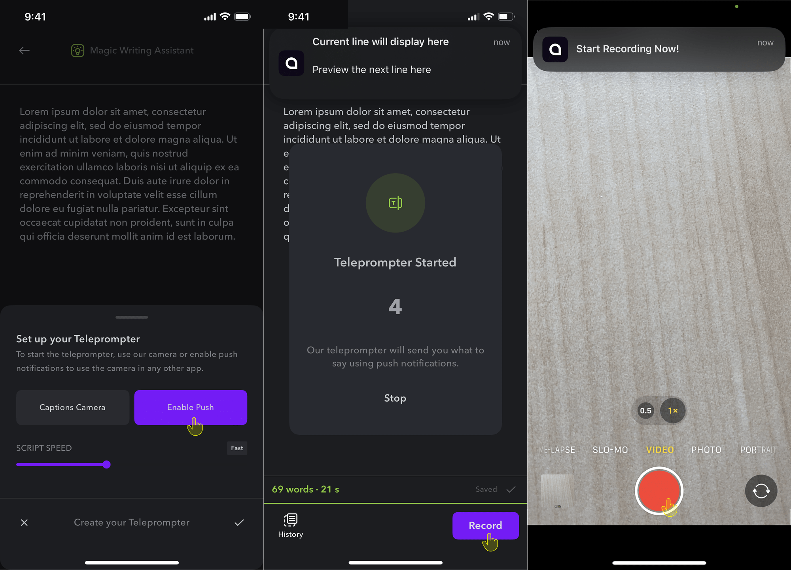

    <Tabs>
            <Tab title="iOS">
                Input your script into the teleprompter and read directly from within the app. Alternatively, use any camera app and use push notifications to deliver your lines.

                ## Captions Camera

                1. Tap **Create** > **Teleprompter**
                2. Type or paste your script from your clipboard
                3. Choose **Captions Camera**
                4. Choose **Scrolling** (one continuous scroll) or **Scenes** (start and stop recording)
                5. Tap **Record**
                <Tip>
                    Tap on the icon on the top right to switch between Scrolling and Scenes.
                </Tip>
                
                ## Push Notifications

                1. Tap **Create**
                2. Tap **Teleprompter**
                3. Type or paste your script from your clipboard
                4. Tap **Enable Push** (notifications)
                5. Tap **Record**
                <Tip>
                    To ensure you receive the push notifications, ensure you have disabled Do Not Disturb and that you've accepted the correct permissions. Open your iPhone Settings > Captions > Notifications.
                </Tip>
                <Frame>
                        
                </Frame>
            </Tab>

            <Tab title="Desktop">
                Coming soon to desktop.
            </Tab>
            <Tab title="Android">
        Coming soon to Android. Please sign up for the [waitlist](/docs/start-guide/get-the-app/android).
        </Tab>
    </Tabs>

    <Tabs>
            <Tab title="Desktop">
                Coming soon to desktop.
            </Tab>

            <Tab title="iOS">
                Input your script into the teleprompter and read directly from within the app. Alternatively, use any camera app and use push notifications to deliver your lines.

                ## Captions Camera

                1. Tap **Create** > **Teleprompter**
                2. Type or paste your script from your clipboard
                3. Choose **Captions Camera**
                4. Choose **Scrolling** (one continuous scroll) or **Scenes** (start and stop recording)
                5. Tap **Record**
                <Tip>
                    Tap on the icon on the top right to switch between Scrolling and Scenes.
                </Tip>
                
                ## Push Notifications

                1. Tap **Create**
                2. Tap **Teleprompter**
                3. Type or paste your script from your clipboard
                4. Tap **Enable Push** (notifications)
                5. Tap **Record**
                <Tip>
                    To ensure you receive the push notifications, ensure you have disabled Do Not Disturb and that you've accepted the correct permissions. Open your iPhone Settings > Captions > Notifications.
                </Tip>
                <Frame>
                        
                </Frame>
            </Tab>

            <Tab title="Android">
        Coming soon to Android. Please sign up for the [waitlist](/docs/start-guide/get-the-app/android).
        </Tab>
    </Tabs>

