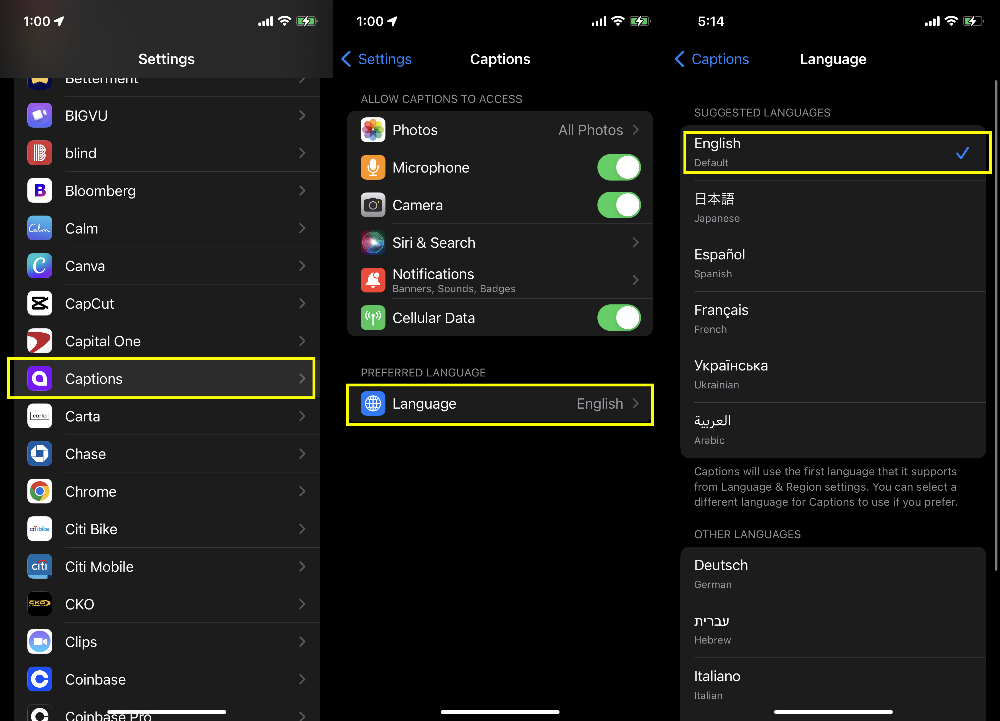

We’d like to ensure our customers across the globe can use our app easily. To help, we’ve localized the app into over 20 languages on iOS and working on adding additional languages for desktop.

<Tabs>
    <Tab title="iOS">
        **To change the language of Captions:**

        1. Open **Settings** on your device
        2. Tap on **Captions**
        3. Tap on **Language**
        4. Choose your language
        <Frame>
            
        </Frame>
    </Tab>

    <Tab title="Desktop">
        Coming soon to desktop
    </Tab>
</Tabs>