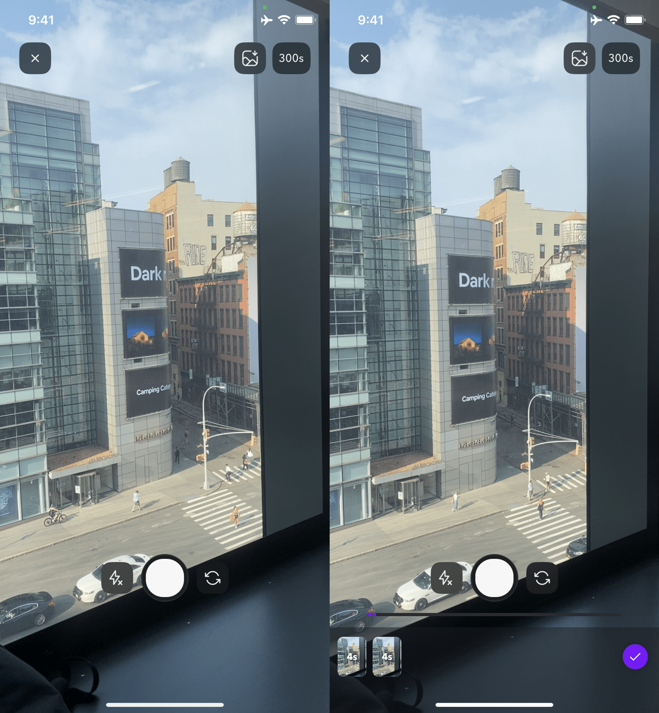
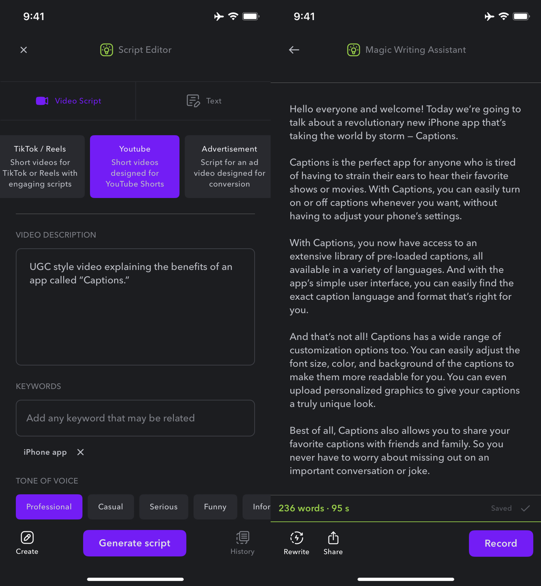
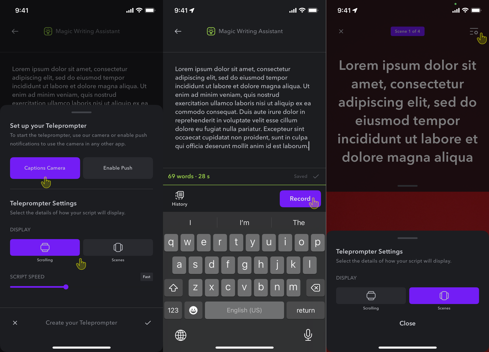
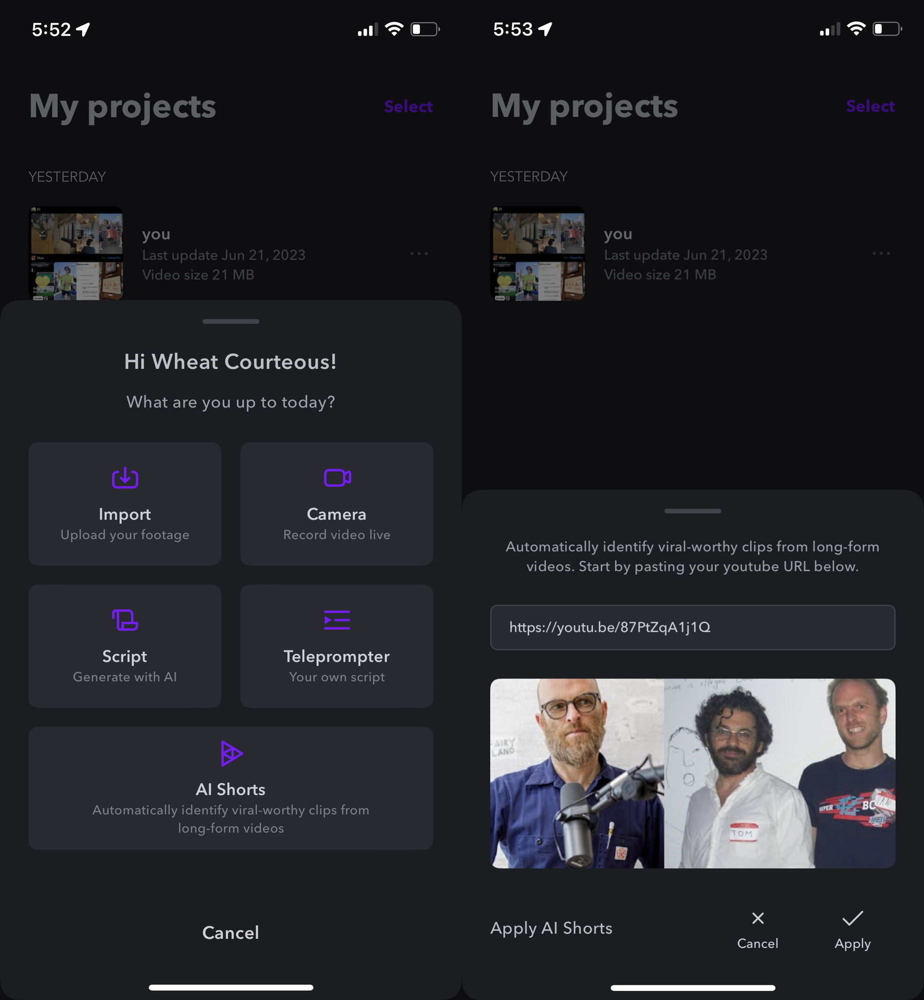

<AccordionGroup>
    <Accordion title="Import">
        If you have all of your footage ready to go, simply import your clip(s) into the app.
        <Tabs>
            <Tab title="iOS">
                To import your clips into the iOS app:

                1. Tap **Create** > **Import**
                2. Choose your first clip to add (If you have more than one clip, tap on the multi-select button)
                3. Trim your video (optional)
                4. Choose your [language settings](/documentation/captions/add-captions)
            </Tab>

            <Tab title="Desktop">
                To import a clip on desktop, simply click "Upload a Video” or drag your clip into Captions. Currently, we only support importing a single clip, but multiple clips will be supported soon.
            </Tab>
        </Tabs>
    </Accordion>

    <Accordion title="Camera">
        Ready to shoot your footage? Use the Captions camera.
        <Tabs>
            <Tab title="iOS">
                To record your video in the iOS app:

                1. Tap **Create** > **Camera**
                2. Tap the circle to start recording
                3. Tap the square to stop recording and continue
                4. Choose your [language settings](/documentation/captions/add-captions)

                **Tips**

                - You can add a flash, flip the camera, and delete clips
                - You can also add clips from [Captions cloud](/documentation/account-and-settings/captions-cloud)
                <Frame>
                    
                </Frame>
            </Tab>
        </Tabs>
    </Accordion>

    <Accordion title="Script">
        Need a little help writing your script? Let Captions help.
        <Tabs>
            <Tab title="iOS">
                **To generate a script in Captions:**

                1. Tap on **Create** > **Script**
                2. Choose your template
                3. Type what you'd like your video to be about
                4. Choose a tone of voice and keywords (optional)
                5. Choose the length and language of your video
                6. Tap **Generate script**
                <Tip>
                    Pro Tip: Tap Record to start recording in the Captions Teleprompter.
                </Tip>
                <Frame>
                        
                </Frame>
            </Tab>

            <Tab title="Desktop">
                Coming soon to desktop.
            </Tab>
        </Tabs>
    </Accordion>

    <Accordion title="Teleprompter">
        Don’t want to memorize your lines? Try the Captions teleprompter.

        <Tabs>
            <Tab title="iOS">
                Input your script into the teleprompter and read directly from within the app. Alternatively, use any camera app and use push notifications to deliver your lines.

                ## **Captions Camera**

                1. Tap **Create** > **Teleprompter**
                2. Type or paste your script from your clipboard
                3. Choose **Captions Camera**
                4. Choose **Scrolling** (one continuous scroll) or **Scenes** (start and stop recording)
                5. Tap **Record**
                <Tip>
                    Pro tip: Tap on the icon on the top right to switch between Scrolling and Scenes.
                </Tip>
                <Frame>
                        
                </Frame>
                
                ## **Push Notifications**

                1. Tap **Create**
                2. Tap **Teleprompter**
                3. Type or paste your script from your clipboard
                4. Tap **Enable Push** (notifications)
                5. Tap **Record**
                <Tip>
                    Pro tip: To ensure you receive the push notifications, ensure you have disabled Do Not Disturb and that you've accepted the correct permissions. Open your iPhone Settings > Captions > Notifications.
                </Tip>
                <Frame>
                        
                </Frame>
            </Tab>

            <Tab title="Desktop">
                Coming soon to desktop.
            </Tab>
        </Tabs>
    </Accordion>

    <Accordion title="AI Shorts">
        AI Shorts automatically identifies and edits viral-worthy clips from your long-form footage on YouTube to quickly create short-form content, promote long-form videos, and maximize the value of your existing material.
        <Tabs>
            <Tab title="iOS">
                **To extract viral-worthy clips from YouTube with AI Shorts:**

                **Step 1 - Choose your video**

                - Tap **Create**
                - Tap **AI Shorts**
                - Paste the YouTube URL, and **Apply**
                - Wait for your clips to be extracted - This can take up to an hour

                **Step 2 - Download your clips**

                - When your clips are complete, you'll receive a push notification
                - Open the app and review your clips - You'll receive up to 5 clips between 15 and 60 seconds in length (depending on the length of your original video)
                - Download your shorts
                - Once they are downloaded, you can open each one as a project. Captions will automatically be added in the original language and you can edit the video like any other project.

                ****Important****

                - Only YouTube links are supported
                - Videos must be between 10 minutes and 2 hours long
                - Supported languages: Chinese, Dutch, English, French, German, Italian. Japanese, Korean. Portuguese, Spanish, and Swedish
                - Captions can only be generated in the original language
                <Frame>
                            
                </Frame>
            </Tab>

            <Tab title="Desktop">
                AI Shorts is coming soon to desktop.
            </Tab>
        </Tabs>
    </Accordion>
</AccordionGroup>